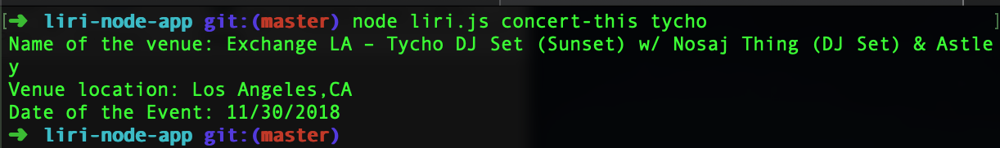

#liri-node-app
LIRI is a Language Interpretation and Recognition Interface. LIRI is a CLI Node application that takes in CLI input and gives requested info. LIRI recognizes four commands: • concert-this • spotify-this-song • movie-this • do-what-it-says

Command Format: "node liri.js", "above four commands", and "artist/song/movie title"

spotify-this-song "song title"

This parameter takes the song title entered and runs it through the Spotify API. The following is logged to the terminal:

Song Title
Artist
Album

movie-this "movie title"

This paramter takes the movie title entered and runs it through the OMDB API and returns the following information:

Movie Title
Year Released
IMDB Rating
Rotten Tomatoes Rating
Countries Where Movie was Produced
Language
Plot
Actors

concert-this "artist/band name"

This parameter takes the band name entered and runs it through the bands in town API and returns concert information for that particular band. The following is logged in the terminal:

Date of the Concert
Venue Name
Venue Location

do-what-it-says "random text"

This parameter takes the information in the random.txt file and returns the info based on random text:
random text sample
concert-this,tycho

